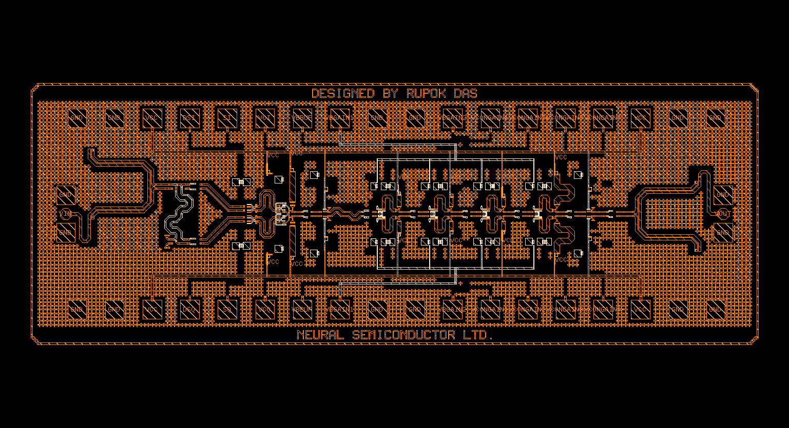

140 to 170 GHz Full 360° Phase Shifter with 5 dB of Gain Control
=================================================================
This document describes the specifications of the D Band Phase Shifter designed for the frequency range of 140 to 170 GHz, which provides a full 360° phase shift with an additional gain control of 5 dB.

.. list-table:: **Specification**
   :widths: 400 200
   :header-rows: 1

   * - Specification
     - Value
   * - Supply Voltage
     - 3.3 V
   * - Bandwidth
     - 140 GHz to 170 GHz
   * - Maximum Small Signal Gain
     - 11 dB
   * - Phase Shift Range
     - 360°
   * - Gain Control Range
     - 5 dB
   * - Power Consumption
     - 245 mW
   * - Area
     - 2 x 0.76 mm²

Layout Image:
========================

   Layout of the D Band Phase Shifter